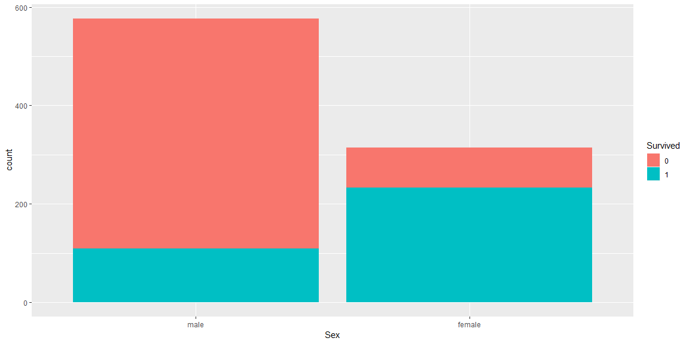

Titanic analysis
================

<style>
    body .main-container {
        max-width: 2900px;
    }
    div.blue { background-color:#e6f0ff; border-radius: 5px; padding: 20px;}
</style>

# Load library

``` r
library(tidyverse)
library(doParallel)
library(caret)
library(lubridate)
library(patchwork)
```

# Load data

``` r
train0 <- read_csv("./titanic/train.csv",
                   col_types = cols(
                     Survived = col_factor(ordered = FALSE, include_na = T),
                     Pclass = col_factor(),
                     Sex = col_factor(),
                     Embarked = col_factor()
                   ))
intrain <- dim(train0)[1]
test0 <- read_csv("./titanic/test.csv",
                  col_types = cols(
                    Pclass = col_factor(),
                    Sex = col_factor(),
                    Embarked = col_factor()
                  ))
```

# Data exploration

First glimpse at our data

``` r
glimpse(train0)
```

    ## Observations: 891
    ## Variables: 12
    ## $ PassengerId <dbl> 1, 2, 3, 4, 5, 6, 7, 8, 9, 10, 11, 12, 13, 14, 15,...
    ## $ Survived    <fct> 0, 1, 1, 1, 0, 0, 0, 0, 1, 1, 1, 1, 0, 0, 0, 1, 0,...
    ## $ Pclass      <fct> 3, 1, 3, 1, 3, 3, 1, 3, 3, 2, 3, 1, 3, 3, 3, 2, 3,...
    ## $ Name        <chr> "Braund, Mr. Owen Harris", "Cumings, Mrs. John Bra...
    ## $ Sex         <fct> male, female, female, female, male, male, male, ma...
    ## $ Age         <dbl> 22, 38, 26, 35, 35, NA, 54, 2, 27, 14, 4, 58, 20, ...
    ## $ SibSp       <dbl> 1, 1, 0, 1, 0, 0, 0, 3, 0, 1, 1, 0, 0, 1, 0, 0, 4,...
    ## $ Parch       <dbl> 0, 0, 0, 0, 0, 0, 0, 1, 2, 0, 1, 0, 0, 5, 0, 0, 1,...
    ## $ Ticket      <chr> "A/5 21171", "PC 17599", "STON/O2. 3101282", "1138...
    ## $ Fare        <dbl> 7.2500, 71.2833, 7.9250, 53.1000, 8.0500, 8.4583, ...
    ## $ Cabin       <chr> NA, "C85", NA, "C123", NA, NA, "E46", NA, NA, NA, ...
    ## $ Embarked    <fct> S, C, S, S, S, Q, S, S, S, C, S, S, S, S, S, S, Q,...

We can see that: - PassengerID is just a sequence of number to
distinguish passengers, hence it has no predictive power.

  - Name follows a pattern with Familyname, Title and Firstname, it
    shows a potential to extract those components

  - SibSp and Parch: aren’t those in the same family have the same
    familyname? Possibly have a relationship with family name

  - Ticket does not follow any obvious pattern

  - A lot of missing values in Cabin

## Dealing with NA

How many NA values?

  - in train set

<!-- end list -->

``` r
train0 %>% map_df(~sum(is.na(.)))
```

    ## # A tibble: 1 x 12
    ##   PassengerId Survived Pclass  Name   Sex   Age SibSp Parch Ticket  Fare
    ##         <int>    <int>  <int> <int> <int> <int> <int> <int>  <int> <int>
    ## 1           0        0      0     0     0   177     0     0      0     0
    ## # ... with 2 more variables: Cabin <int>, Embarked <int>

  - in test set

<!-- end list -->

``` r
test0 %>% map_df(~sum(is.na(.)))
```

    ## # A tibble: 1 x 11
    ##   PassengerId Pclass  Name   Sex   Age SibSp Parch Ticket  Fare Cabin
    ##         <int>  <int> <int> <int> <int> <int> <int>  <int> <int> <int>
    ## 1           0      0     0     0    86     0     0      0     1   327
    ## # ... with 1 more variable: Embarked <int>

Dealing with NA:

  - Remove Cabin as there are too much NA

  - Using median for Fare, only 1 value is missing

  - Using the highest frequency value for Embarked

  - The only predictor relating to Age is Name (Title e.g Mr, Miss,
    etc), so missing Age is replace by the mean of Age of people with
    the same title.

  - Other methods like knnImpute or BagImpute or even some models which
    can handle NA values can be used to impute. However, those seems
    unnecessary complicated methods since they consider all other
    predictors to find NA values, We certainly know that only some
    predictors are directly relating predictors with missing
NA.

## Visualization

### Fare

``` r
p1 <- train0 %>% ggplot() + geom_histogram(aes(Fare, fill = Survived)) + labs(title = "Histogram of Fare \nin relation with Survived")
p2<- train0 %>% ggplot() + geom_histogram(aes(Fare, fill = Survived), position = "fill") + labs(title = "Percentage of Fare \nin relation with Survived")
p1 + p2
```


Distibution of Fare is skewed to the right, transform it with log10 to
normalize

``` r
p1 <- train0 %>% ggplot() + geom_histogram(aes(log10(Fare+1), fill = Survived)) + labs(title = "Histogram of Fare \nin relation with Survived")
p2<- train0 %>% ggplot() + geom_histogram(aes(log10(Fare+1), fill = Survived), position = "fill") + labs(title = "Percentage of Fare \nin relation with Survived")
p1 + p2
```


There is a patern in Fare in relation with Survived. More expensive
ticket, higher chance to Survive (to an extend).

<br>

Good
predictor

### Pclass

``` r
train0 %>% ggplot() + geom_bar(aes(fct_relevel(Pclass, "1", "2"), fill = Survived)) + scale_x_discrete(name = "Pclass")
```


Pclass 1 \> Pclass 2 \> Pclass 3 in survival rate and there are much
more people in Pclass 3 than Pclass 1 and
2.

``` r
train0 %>% ggplot() + geom_boxplot(aes(fct_reorder(Pclass,Fare), Fare)) + scale_x_discrete(name = "Pclass")
```


The cost of Ticket increases from PClass 3 (cheapest) to Pclass 1 (most
expensive).

<br>

This makes sense as the upper class who stayed in Pclass 1 would have
more money hence have better chance to survive.

<br>

Good
predictor

### Sex

``` r
train0 %>% ggplot() + geom_bar(aes(Sex, fill = Survived))
```



Female have better survival rate as women and children are usually being
rescued first.

<br>

Good
predictor

# Data transformation

## Combine test and train for feature selection

``` r
combined <- bind_rows(train0, test0)
```

## Recode survive for caret train as 1 and 0 are not valid level name in R

``` r
combined$Survived <- fct_recode(combined$Survived, "Lived" = "1", "Died" = "0") %>% 
  fct_relevel("Lived")
```

## Extract Title

``` r
combined <- combined %>% mutate(Title = str_extract(Name, ", (\\w)+")) %>% 
  mutate(Title = str_extract(Title, "\\w+"))
```

## Remove those title different from Miss, Master, Mr and Mrs since they are low frequency

``` r
combined %>% ggplot() + geom_bar(aes(Title))
```

<!-- -->

Then combine them into Others

``` r
combined <- combined %>%
  mutate(Title = ifelse(Title %in% c("Miss", "Master", "Mr", "Mrs"), Title,"Others"))
```

How this Title predictor
look

``` r
combined[1:intrain,] %>% ggplot() + geom_bar(aes(Title, fill = fct_relevel(Survived, "Died"))) + labs(fill = "Survived")
```


Good predictor. <br> In combination with Pclass, we can see a more
detail picture.

``` r
combined[1:intrain,] %>% 
    group_by(Title, Pclass, Survived) %>% 
    summarise(each = n()) %>% ungroup() %>% group_by(Title, Pclass) %>% mutate(Tot = sum(each)) %>%
  mutate(Survivalrate = each/Tot) %>% 
  ungroup() %>% filter(Survived == "Lived") %>% 
  ggplot() + geom_tile(aes(fct_relevel(Pclass,"1","2"), fct_relevel(Title,"Master", "Miss", "Mrs", "Mr"), fill = Survivalrate)) + scale_fill_viridis_c() + xlab("Pclass") + ylab("Title")
```


## Make Missingage predictor before we impute Age

``` r
combined <- combined %>% mutate(MissingAge = is.na(Age))
```

## Use Title to predict Age

Master are underage male children(Fact). Take mean Age from train set
and use it to replace NA from all data with Master title

``` r
meanMasterAge <- combined %>%
  slice(1:dim(train0)[1]) %>% 
  filter(Title == "Master") %>% 
  summarise(mean(Age, na.rm = T)) %>% 
  pull()
combined <- combined %>% 
  mutate(Age = ifelse(Title == "Master" & is.na(Age), meanMasterAge ,Age ))
```

Impute Age based on other
Title

``` r
combined[is.na(combined$Age) & combined$Title == "Mr",]$Age <- mean(combined[1:intrain,][combined[1:intrain,]$Title == "Mr",]$Age, na.rm = T)
combined[is.na(combined$Age) & combined$Title == "Miss",]$Age <- mean(combined[1:intrain,][combined[1:intrain,]$Title == "Miss",]$Age, na.rm = T)
combined[is.na(combined$Age) & combined$Title == "Mrs",]$Age <- mean(combined[1:intrain,][combined[1:intrain,]$Title == "Mrs",]$Age, na.rm = T)
combined[is.na(combined$Age) & combined$Title == "Others",]$Age <- mean(combined[1:intrain,][combined[1:intrain,]$Title == "Others",]$Age, na.rm = T)
```

## Impute Embarked

``` r
combined[is.na(combined$Embarked),]$Embarked <- "S"
```

## Impute Fare

``` r
combined[is.na(combined$Fare),]$Fare <- mean(combined[1:intrain,][combined[1:intrain,]$Pclass == 3,]$Fare, na.rm = T)
```

## Family name

``` r
combined <- combined %>% mutate(Familyname = str_extract(Name, "^.+,")) %>% 
  mutate(Familyname = str_sub(Familyname,1, -2)) 
```

## Transform Fare

``` r
combined <- combined %>% mutate(Fare = log10(Fare +1))
```

## Make groupsize predictor

A. There are people with same Ticket but different Family name B. There
are people with same Familyname but different Ticket C. There are people
with same Familyname and same Ticket

The groupsize of a person is determined by number of other people with
same ticket and family name. (A + B -
C)

``` r
combined <- combined %>% group_by(Ticket, Familyname) %>% mutate(nAll = n()) %>% 
  ungroup() %>% group_by(Ticket) %>% mutate(nTicket = n()) %>% 
  ungroup() %>% group_by(Familyname) %>% mutate(nFamilyname = n()) %>% 
  ungroup() %>% mutate(Groupsize = nTicket + nFamilyname - nAll) 
```

How this new groupsize predictor look

``` r
combined[1:intrain,] %>% 
  ggplot() + geom_bar(aes(Groupsize, fill = fct_relevel(Survived, "Died")), position = "fill")
```

<!-- -->

``` r
combined[1:intrain,] %>% 
    group_by(Pclass,Groupsize, Title, Survived) %>% 
    summarise(each = n()) %>% ungroup() %>% group_by(Pclass, Groupsize, Title) %>% mutate(Tot = sum(each)) %>%
  mutate(Survivalrate = each/Tot) %>% 
  ungroup() %>% filter(Survived == "Lived") %>% 
  ggplot() + geom_tile(aes(fct_relevel(Title, "Master", "Miss", "Mrs"), Groupsize, fill = Survivalrate)) + scale_fill_viridis_c() + xlab("Title") + ylab("Groupsize") + facet_wrap(.~fct_relevel(Pclass, "1", "2"))
```

<!-- --> Some pattern but not
really clear.

# Final look ————————————————————–

``` r
glimpse(combined)
```

    ## Observations: 1,309
    ## Variables: 19
    ## $ PassengerId <dbl> 1, 2, 3, 4, 5, 6, 7, 8, 9, 10, 11, 12, 13, 14, 15,...
    ## $ Survived    <fct> Died, Lived, Lived, Lived, Died, Died, Died, Died,...
    ## $ Pclass      <fct> 3, 1, 3, 1, 3, 3, 1, 3, 3, 2, 3, 1, 3, 3, 3, 2, 3,...
    ## $ Name        <chr> "Braund, Mr. Owen Harris", "Cumings, Mrs. John Bra...
    ## $ Sex         <fct> male, female, female, female, male, male, male, ma...
    ## $ Age         <dbl> 22.00000, 38.00000, 26.00000, 35.00000, 35.00000, ...
    ## $ SibSp       <dbl> 1, 1, 0, 1, 0, 0, 0, 3, 0, 1, 1, 0, 0, 1, 0, 0, 4,...
    ## $ Parch       <dbl> 0, 0, 0, 0, 0, 0, 0, 1, 2, 0, 1, 0, 0, 5, 0, 0, 1,...
    ## $ Ticket      <chr> "A/5 21171", "PC 17599", "STON/O2. 3101282", "1138...
    ## $ Fare        <dbl> 0.9164539, 1.8590380, 0.9506082, 1.7331973, 0.9566...
    ## $ Cabin       <chr> NA, "C85", NA, "C123", NA, NA, "E46", NA, NA, NA, ...
    ## $ Embarked    <fct> S, C, S, S, S, Q, S, S, S, C, S, S, S, S, S, S, Q,...
    ## $ Title       <chr> "Mr", "Mrs", "Miss", "Mrs", "Mr", "Mr", "Mr", "Mas...
    ## $ MissingAge  <lgl> FALSE, FALSE, FALSE, FALSE, FALSE, TRUE, FALSE, FA...
    ## $ Familyname  <chr> "Braund", "Cumings", "Heikkinen", "Futrelle", "All...
    ## $ nAll        <int> 1, 2, 1, 2, 1, 1, 1, 5, 3, 2, 3, 1, 1, 7, 1, 1, 6,...
    ## $ nTicket     <int> 1, 2, 1, 2, 1, 1, 2, 5, 3, 2, 3, 1, 1, 7, 1, 1, 6,...
    ## $ nFamilyname <int> 2, 2, 1, 2, 2, 3, 2, 5, 6, 2, 3, 2, 1, 11, 1, 1, 6...
    ## $ Groupsize   <int> 2, 2, 1, 2, 2, 3, 3, 5, 6, 2, 3, 2, 1, 11, 1, 1, 6...

# Remove bad columns ———————————————

``` r
combined <- combined %>% select(-PassengerId, -Name, -Cabin, -SibSp, -Parch, -Ticket, -Familyname, -nFamilyname, -nAll, -nTicket)

combined <- combined %>% select(-MissingAge, -Embarked)
```

# Dummy coded columns ————————————————————-

``` r
dummy <- dummyVars(~., data = combined[,-1]) 
dummy_combined <- predict(dummy, newdata = combined[,-1]) %>% as_tibble()
dummy_combined$Survived <- combined$Survived
dummy_combined <- dummy_combined %>% 
  select(Survived, everything())
```

# Prepare model building ———————————————————-

``` r
set.seed(99999)
notinholdout <- createDataPartition(train0$Survived, p = 0.8, list = F)
length(notinholdout)
```

    ## [1] 714

# train and test set

``` r
alltrain <- dummy_combined[1:intrain,]
train <- dummy_combined[1:intrain,] %>% slice(notinholdout) 
holdout <- dummy_combined[1:intrain,] %>% slice(-notinholdout) 
test <- dummy_combined[-(1:intrain),]
```

# Validation folds ————————————————————–

index \<- createMultiFolds(train$Survived, k = 10, times =
5)

# Traincontrol ————————————————————

# Index takes over other parameters, supply them just to get the labels right

trCtr \<- trainControl(method = “repeatedcv”, repeats = 5, number = 10,
index = index, verboseIter=TRUE, classProbs = T)

trCtr\_search \<- trainControl(method = “repeatedcv”, repeats = 5,
number = 5, index = index, savePredictions = “final”, summaryFunction =
twoClassSummary, search = “random”, verboseIter=TRUE, classProbs = T)
trCtr\_none \<- trainControl(method = “none”, classProbs = T)

cl \<- makeCluster(7) registerDoParallel(cl)

# Get model info ———————————————————-

getModelInfo()\(xgbTree\)parameters

# Formula —————————————————————-

colnames(dummy\_combined) formula \<- as.formula(Survived \~ .)

# Train ——————————————————————-

rf \<- train(formula, data = alltrain, trControl = trCtr\_search, method
= “rf”, tuneLength = 10) xgb \<- train(formula, data = alltrain,
trControl = trCtr\_search, method = “xgbTree”, tuneLength = 20)

SVM \<- train(formula, data = alltrain, trControl = trCtr\_search,
method = “svmRadial”, metric = “ROC”, preProcess = c(“center”, “scale”),
tuneLength = 20)

rpart \<- train(formula, data = alltrain, trControl = trCtr\_search,
method = “rpart”, tuneLength = 20)

C5.0 \<- train(formula, data = alltrain, trControl = trCtr\_search,
method = “C5.0”, tuneLength =
20)

plot(partykit::as.party(C5.0\(finalModel)) plot(partykit::as.party(rpart\)finalModel))
plot(varImp(rf))

plot(varImp(xgb))

# final ——————————————————————-

all \<- list(xgb = xgb, rf = rf, SVM = SVM) all \<- list(SVM = SVM)

finaltest \<- predict(all, newdata = test, na.action = na.pass)

prefix \<- “groupsize\_all\_imp\_ROC”

for (i in names(finaltest)){ bind\_cols(PassengerID = test0$PassengerId,
Survived = finaltest\[\[i\]\]) %\>% mutate(Survived =
fct\_recode(Survived, “1” = “Lived”, “0” = “Died”)) %\>%
write\_csv(str\_c(“./prediction/”, prefix,“*" ,i,"*”, today(), “.csv”))
}

best

# PLOT

``` r
combined %>% ggplot() + geom_bar(aes(Age))
```

<!-- -->
