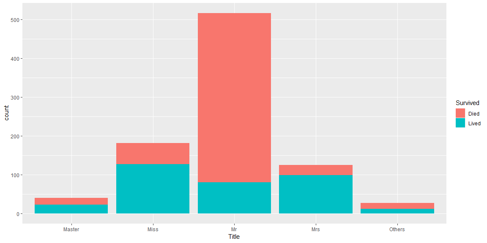
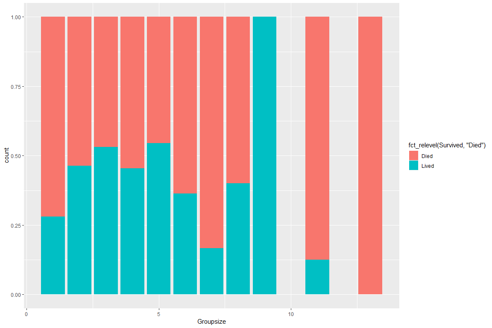
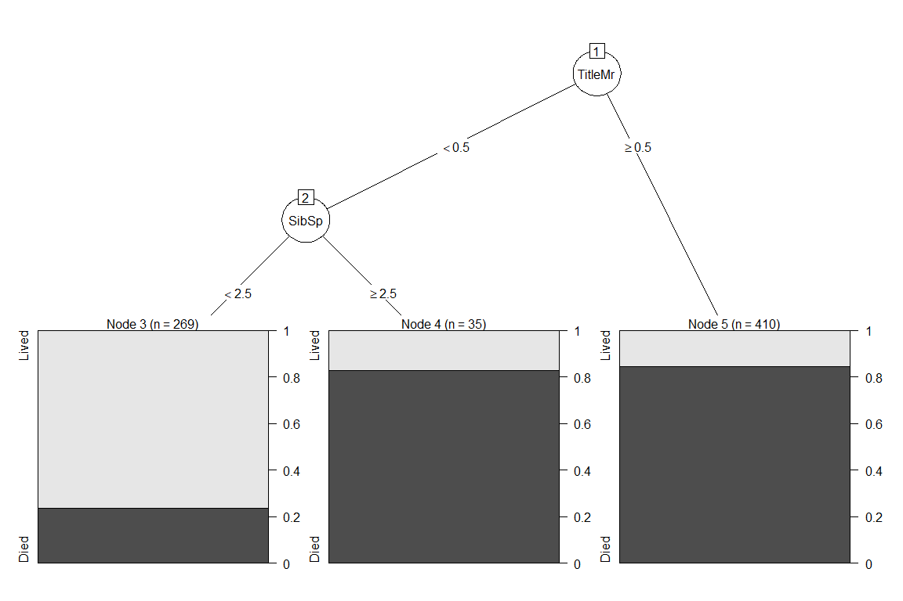
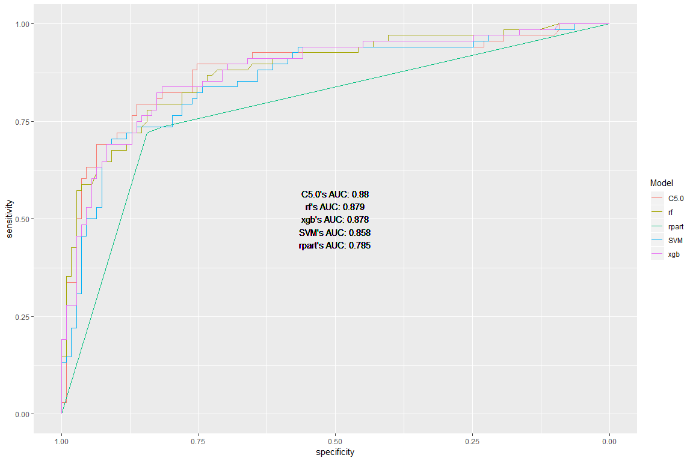

Titanic analysis
================

# Load library

``` r
library(tidyverse)
library(doParallel)
library(caret)
library(lubridate)
library(patchwork)
library(caretEnsemble)
library(pROC)
library(partykit)
```

# Load data

``` r
train0 <- read_csv("./titanic/train.csv",
                   col_types = cols(
                     Survived = col_factor(ordered = FALSE, include_na = T),
                     Pclass = col_factor(),
                     Sex = col_factor(),
                     Embarked = col_factor()
                   ))
intrain <- dim(train0)[1]
test0 <- read_csv("./titanic/test.csv",
                  col_types = cols(
                    Pclass = col_factor(),
                    Sex = col_factor(),
                    Embarked = col_factor()
                  ))
```

# Data exploration

First glimpse at our data

``` r
glimpse(train0)
```

    ## Observations: 891
    ## Variables: 12
    ## $ PassengerId <dbl> 1, 2, 3, 4, 5, 6, 7, 8, 9, 10, 11, 12, 13, 14, 15,...
    ## $ Survived    <fct> 0, 1, 1, 1, 0, 0, 0, 0, 1, 1, 1, 1, 0, 0, 0, 1, 0,...
    ## $ Pclass      <fct> 3, 1, 3, 1, 3, 3, 1, 3, 3, 2, 3, 1, 3, 3, 3, 2, 3,...
    ## $ Name        <chr> "Braund, Mr. Owen Harris", "Cumings, Mrs. John Bra...
    ## $ Sex         <fct> male, female, female, female, male, male, male, ma...
    ## $ Age         <dbl> 22, 38, 26, 35, 35, NA, 54, 2, 27, 14, 4, 58, 20, ...
    ## $ SibSp       <dbl> 1, 1, 0, 1, 0, 0, 0, 3, 0, 1, 1, 0, 0, 1, 0, 0, 4,...
    ## $ Parch       <dbl> 0, 0, 0, 0, 0, 0, 0, 1, 2, 0, 1, 0, 0, 5, 0, 0, 1,...
    ## $ Ticket      <chr> "A/5 21171", "PC 17599", "STON/O2. 3101282", "1138...
    ## $ Fare        <dbl> 7.2500, 71.2833, 7.9250, 53.1000, 8.0500, 8.4583, ...
    ## $ Cabin       <chr> NA, "C85", NA, "C123", NA, NA, "E46", NA, NA, NA, ...
    ## $ Embarked    <fct> S, C, S, S, S, Q, S, S, S, C, S, S, S, S, S, S, Q,...

We can see that: - PassengerID is just a sequence of number to
distinguish passengers, hence it has no predictive power.

  - Name follows a pattern with Familyname, Title and Firstname, it
    shows a potential to extract those components

  - SibSp and Parch: aren’t those in the same family have the same
    familyname? Possibly have a relationship with family name

  - Ticket does not follow any obvious pattern

  - A lot of missing values in Cabin

## Dealing with NA

How many NA values?

  - in train set

<!-- end list -->

``` r
train0 %>% map_df(~sum(is.na(.)))
```

    ## # A tibble: 1 x 12
    ##   PassengerId Survived Pclass  Name   Sex   Age SibSp Parch Ticket  Fare
    ##         <int>    <int>  <int> <int> <int> <int> <int> <int>  <int> <int>
    ## 1           0        0      0     0     0   177     0     0      0     0
    ## # ... with 2 more variables: Cabin <int>, Embarked <int>

  - in test set

<!-- end list -->

``` r
test0 %>% map_df(~sum(is.na(.)))
```

    ## # A tibble: 1 x 11
    ##   PassengerId Pclass  Name   Sex   Age SibSp Parch Ticket  Fare Cabin
    ##         <int>  <int> <int> <int> <int> <int> <int>  <int> <int> <int>
    ## 1           0      0     0     0    86     0     0      0     1   327
    ## # ... with 1 more variable: Embarked <int>

Dealing with NA:

  - Remove Cabin as there are too much NA

  - Using median for Fare, only 1 value is missing

  - Using the highest frequency value for Embarked

  - The only predictor relating to Age is Name (Title e.g Mr, Miss,
    etc), so missing Age is replace by the mean of Age of people with
    the same title.

  - Other methods like knnImpute or BagImpute or even some models which
    can handle NA values can be used to impute. However, those seems
    unnecessary complicated methods since they consider all other
    predictors to find NA values, We certainly know that only some
    predictors are directly relating predictors with missing
NA.

## Visualization

### Fare

``` r
p1 <- train0 %>% ggplot() + geom_histogram(aes(Fare, fill = Survived)) + labs(title = "Histogram of Fare \nin relation with Survived")
p2<- train0 %>% ggplot() + geom_histogram(aes(Fare, fill = Survived), position = "fill") + labs(title = "Percentage of Fare \nin relation with Survived")
p1 + p2
```


Distibution of Fare is skewed to the right, transform it with log10 to
normalize

``` r
p1 <- train0 %>% ggplot() + geom_histogram(aes(log10(Fare+1), fill = Survived)) + labs(title = "Histogram of Fare \nin relation with Survived")
p2<- train0 %>% ggplot() + geom_histogram(aes(log10(Fare+1), fill = Survived), position = "fill") + labs(title = "Percentage of Fare \nin relation with Survived")
p1 + p2
```


There is a patern in Fare in relation with Survived. More expensive
ticket, higher chance to Survive (to an extend).

<br>

Good
predictor

### Pclass

``` r
train0 %>% ggplot() + geom_bar(aes(fct_relevel(Pclass, "1", "2"), fill = Survived)) + scale_x_discrete(name = "Pclass")
```


Pclass 1 \> Pclass 2 \> Pclass 3 in survival rate and there are much
more people in Pclass 3 than Pclass 1 and
2.

``` r
train0 %>% ggplot() + geom_boxplot(aes(fct_reorder(Pclass,Fare), Fare)) + scale_x_discrete(name = "Pclass")
```


The cost of Ticket increases from PClass 3 (cheapest) to Pclass 1 (most
expensive).

<br>

This makes sense as the upper class who stayed in Pclass 1 would have
more money hence have better chance to survive.

<br>

Good
predictor

### Sex

``` r
train0 %>% ggplot() + geom_bar(aes(Sex, fill = Survived))
```


Female have better survival rate as women and children are usually being
rescued first.

<br>

Good
predictor

# Data transformation

## Combine test and train for feature selection

``` r
combined <- bind_rows(train0, test0)
```

## Recode survive for caret train as 1 and 0 are not valid level name in R

``` r
combined$Survived <- fct_recode(combined$Survived, "Lived" = "1", "Died" = "0") %>% 
  fct_relevel("Lived")
```

## Extract Title

``` r
combined <- combined %>% mutate(Title = str_extract(Name, ", (\\w)+")) %>% 
  mutate(Title = str_extract(Title, "\\w+"))
```

## Remove those title different from Miss, Master, Mr and Mrs since they are low frequency

``` r
combined %>% ggplot() + geom_bar(aes(Title))
```

<!-- -->

Then combine them into Others

``` r
combined <- combined %>%
  mutate(Title = ifelse(Title %in% c("Miss", "Master", "Mr", "Mrs"), Title,"Others"))
```

How this Title predictor
look

``` r
combined[1:intrain,] %>% ggplot() + geom_bar(aes(Title, fill = fct_relevel(Survived, "Died"))) + labs(fill = "Survived")
```


Good predictor. <br> In combination with Pclass, we can see a more
detail picture.

``` r
combined[1:intrain,] %>% 
    group_by(Title, Pclass, Survived) %>% 
    summarise(each = n()) %>% ungroup() %>% group_by(Title, Pclass) %>% mutate(Tot = sum(each)) %>%
  mutate(Survivalrate = each/Tot) %>% 
  ungroup() %>% filter(Survived == "Lived") %>% 
  ggplot() + geom_tile(aes(fct_relevel(Pclass,"1","2"), fct_relevel(Title,"Master", "Miss", "Mrs", "Mr"), fill = Survivalrate)) + scale_fill_viridis_c() + xlab("Pclass") + ylab("Title")
```


## Make Missingage predictor before we impute Age

``` r
combined <- combined %>% mutate(MissingAge = is.na(Age))
```

## Use Title to predict Age

Master are underage male children(Fact). Take mean Age from train set
and use it to replace NA from all data with Master title

``` r
meanMasterAge <- combined %>%
  slice(1:dim(train0)[1]) %>% 
  filter(Title == "Master") %>% 
  summarise(mean(Age, na.rm = T)) %>% 
  pull()
combined <- combined %>% 
  mutate(Age = ifelse(Title == "Master" & is.na(Age), meanMasterAge ,Age ))
```

Impute Age based on other
Title

``` r
combined[is.na(combined$Age) & combined$Title == "Mr",]$Age <- mean(combined[1:intrain,][combined[1:intrain,]$Title == "Mr",]$Age, na.rm = T)
combined[is.na(combined$Age) & combined$Title == "Miss",]$Age <- mean(combined[1:intrain,][combined[1:intrain,]$Title == "Miss",]$Age, na.rm = T)
combined[is.na(combined$Age) & combined$Title == "Mrs",]$Age <- mean(combined[1:intrain,][combined[1:intrain,]$Title == "Mrs",]$Age, na.rm = T)
combined[is.na(combined$Age) & combined$Title == "Others",]$Age <- mean(combined[1:intrain,][combined[1:intrain,]$Title == "Others",]$Age, na.rm = T)
```

## Impute Embarked by median

``` r
combined[is.na(combined$Embarked),]$Embarked <- "S"
```

## Impute Fare by mean

``` r
combined[is.na(combined$Fare),]$Fare <- mean(combined[1:intrain,][combined[1:intrain,]$Pclass == 3,]$Fare, na.rm = T)
```

## Family name

``` r
combined <- combined %>% mutate(Familyname = str_extract(Name, "^.+,")) %>% 
  mutate(Familyname = str_sub(Familyname,1, -2)) 
```

## Transform Fare to log(Fare)

``` r
combined <- combined %>% mutate(Fare = log10(Fare +1))
```

## Make groupsize predictor

A. There are people with same Ticket but different Family name B. There
are people with same Familyname but different Ticket C. There are people
with same Familyname and same Ticket

The groupsize of a person is determined by number of other people with
same ticket and family name. (A + B -
C)

``` r
combined <- combined %>% group_by(Ticket, Familyname) %>% mutate(nAll = n()) %>% 
  ungroup() %>% group_by(Ticket) %>% mutate(nTicket = n()) %>% 
  ungroup() %>% group_by(Familyname) %>% mutate(nFamilyname = n()) %>% 
  ungroup() %>% mutate(Groupsize = nTicket + nFamilyname - nAll) 

combined <- combined %>% select(-nTicket, -nFamilyname)
```

How this new groupsize predictor look

``` r
combined[1:intrain,] %>% 
  ggplot() + geom_bar(aes(Groupsize, fill = fct_relevel(Survived, "Died")), position = "fill")
```

<!-- -->

``` r
combined[1:intrain,] %>% 
    group_by(Pclass,Groupsize, Title, Survived) %>% 
    summarise(each = n()) %>% ungroup() %>% group_by(Pclass, Groupsize, Title) %>% mutate(Tot = sum(each)) %>%
  mutate(Survivalrate = each/Tot) %>% 
  ungroup() %>% filter(Survived == "Lived") %>% 
  ggplot() + geom_tile(aes(fct_relevel(Title, "Master", "Miss", "Mrs"), Groupsize, fill = Survivalrate)) + scale_fill_viridis_c() + xlab("Title") + ylab("Groupsize") + facet_wrap(.~fct_relevel(Pclass, "1", "2"))
```

<!-- --> Some pattern but not
really clear.

## Final look

``` r
glimpse(combined)
```

    ## Observations: 1,309
    ## Variables: 17
    ## $ PassengerId <dbl> 1, 2, 3, 4, 5, 6, 7, 8, 9, 10, 11, 12, 13, 14, 15,...
    ## $ Survived    <fct> Died, Lived, Lived, Lived, Died, Died, Died, Died,...
    ## $ Pclass      <fct> 3, 1, 3, 1, 3, 3, 1, 3, 3, 2, 3, 1, 3, 3, 3, 2, 3,...
    ## $ Name        <chr> "Braund, Mr. Owen Harris", "Cumings, Mrs. John Bra...
    ## $ Sex         <fct> male, female, female, female, male, male, male, ma...
    ## $ Age         <dbl> 22.00000, 38.00000, 26.00000, 35.00000, 35.00000, ...
    ## $ SibSp       <dbl> 1, 1, 0, 1, 0, 0, 0, 3, 0, 1, 1, 0, 0, 1, 0, 0, 4,...
    ## $ Parch       <dbl> 0, 0, 0, 0, 0, 0, 0, 1, 2, 0, 1, 0, 0, 5, 0, 0, 1,...
    ## $ Ticket      <chr> "A/5 21171", "PC 17599", "STON/O2. 3101282", "1138...
    ## $ Fare        <dbl> 0.9164539, 1.8590380, 0.9506082, 1.7331973, 0.9566...
    ## $ Cabin       <chr> NA, "C85", NA, "C123", NA, NA, "E46", NA, NA, NA, ...
    ## $ Embarked    <fct> S, C, S, S, S, Q, S, S, S, C, S, S, S, S, S, S, Q,...
    ## $ Title       <chr> "Mr", "Mrs", "Miss", "Mrs", "Mr", "Mr", "Mr", "Mas...
    ## $ MissingAge  <lgl> FALSE, FALSE, FALSE, FALSE, FALSE, TRUE, FALSE, FA...
    ## $ Familyname  <chr> "Braund", "Cumings", "Heikkinen", "Futrelle", "All...
    ## $ nAll        <int> 1, 2, 1, 2, 1, 1, 1, 5, 3, 2, 3, 1, 1, 7, 1, 1, 6,...
    ## $ Groupsize   <int> 2, 2, 1, 2, 2, 3, 3, 5, 6, 2, 3, 2, 1, 11, 1, 1, 6...

# Training ————————————————————–

## Separate train and test set since we are done with Data transformation

Separate 20% of the train set into holdout set to evaluate the models,
it is more convenient than using using upload test set to Kaggle
everytime.

``` r
set.seed(12345)
notinholdout <- createDataPartition(train0$Survived, p = 0.8, list = F)

alltrain <- combined[1:intrain, ]

train <- combined[1:intrain, ] %>% slice(notinholdout) 
holdout <- combined[1:intrain, ] %>% slice(-notinholdout) 

test <- combined[-(1:intrain), ]
```

## Validation folds

5 times repeated 10 folds is used to evaluate model’s parameters. It is
usually specified inside the trainControl but separate this step is a
requirement for caretEnsemble to make sure all folds are consistent for
ensemble.

``` r
index <- createMultiFolds(train$Survived, k = 10, times = 5)
```

## Traincontrol

The index will take over other parameters, supply them just to get the
labels right. We will use the metric ROC for this, so twoClassSummary
and classProbs must be specified

``` r
trCtr_grid <- trainControl(method = "repeatedcv", repeats = 5, 
                           number = 5, 
                           index = index, savePredictions = "final", summaryFunction = twoClassSummary,
                           search = "grid", # By default  
                           verboseIter=TRUE, classProbs = T)
                             
trCtr_none <- trainControl(method = "none", classProbs = T)
```

\= \#\# Setup parallel computing

``` r
cl <- makeCluster(7)
registerDoParallel(cl)
```

## Get model info if needed

``` r
getModelInfo()$xgbTree$parameters
```

    ##          parameter   class                          label
    ## 1          nrounds numeric          # Boosting Iterations
    ## 2        max_depth numeric                 Max Tree Depth
    ## 3              eta numeric                      Shrinkage
    ## 4            gamma numeric         Minimum Loss Reduction
    ## 5 colsample_bytree numeric     Subsample Ratio of Columns
    ## 6 min_child_weight numeric Minimum Sum of Instance Weight
    ## 7        subsample numeric           Subsample Percentage

## Choose Hyperparameters

``` r
C5.0grid <- expand.grid(.trials = c(1:9, (1:10)*10),
                       .model = c("tree", "rules"),
                       .winnow = c(TRUE, FALSE))

SVMgrid <- expand.grid(sigma = c(0, 0.01, 0.04, 0.2),
                       C= c(seq(0,1,0.2),10,500))
                      
XGBgrid <- expand.grid(nrounds = 100, # Fixed. depend on datasize
                       max_depth = 6, # More will make model more complex and more likely to overfit. Choose only this due to computational barrier
                       eta = c(0.01,0.05, 0.1), # NEED FINE TUNE
                       gamma = 0, # it is usually OK to leave at 0
                       min_child_weight = c(1,2,3), # The higher value, the more conservative model is, NEED FINE TUNE
                       colsample_bytree = c(.4, .7, 1), # subsample by columns
                       subsample = 1) # subsample by row leave at 1 since we doing k-fold

rpartgrid <- expand.grid(cp = runif(30,0,0.5))

rfgrid <- expand.grid(mtry = 1:8)
```

## Train models

Choose predictors

``` r
formula <- as.formula(Survived ~ Pclass + Sex + Title +
                        Age + MissingAge + SibSp + Parch + Groupsize + 
                        Fare + Embarked)
```

We will use caret ensemble for easy training

``` r
set.seed(67659)

modelList <- caretList(
  formula, data = train,
  trControl=trCtr_grid,
  metric = "ROC",
  tuneList=list(
    rf=caretModelSpec(method="rf", tuneGrid= rfgrid),
    SVM=caretModelSpec(method="svmRadial", tuneGrid = SVMgrid,
                       preProcess = c("scale", "center")),
    xgb=caretModelSpec(method="xgbTree", tuneGrid = XGBgrid),
    rpart= caretModelSpec(method = "rpart", tuneGrid = rpartgrid),
    C5.0 = caretModelSpec(method = "C5.0", tuneGrid = C5.0grid)
    )
)
```

    ## Aggregating results
    ## Selecting tuning parameters
    ## Fitting mtry = 6 on full training set

    ## Warning in nominalTrainWorkflow(x = x, y = y, wts = weights, info =
    ## trainInfo, : There were missing values in resampled performance measures.

    ## Aggregating results
    ## Selecting tuning parameters
    ## Fitting sigma = 0.2, C = 0.4 on full training set
    ## Aggregating results
    ## Selecting tuning parameters
    ## Fitting nrounds = 100, max_depth = 6, eta = 0.05, gamma = 0, colsample_bytree = 0.4, min_child_weight = 2, subsample = 1 on full training set
    ## Aggregating results
    ## Selecting tuning parameters
    ## Fitting cp = 0.0228 on full training set
    ## Aggregating results
    ## Selecting tuning parameters
    ## Fitting trials = 100, model = rules, winnow = FALSE on full training set

# Evaluation

## Evaluate in train data

``` r
dotplot(resamples(modelList))
```

<!-- -->

  - rpart seems to be the worst model.

Let’s see if there is any significant different between them

``` r
diff(resamples(modelList), metric = "ROC") %>% summary()
```

    ## 
    ## Call:
    ## summary.diff.resamples(object = .)
    ## 
    ## p-value adjustment: bonferroni 
    ## Upper diagonal: estimates of the difference
    ## Lower diagonal: p-value for H0: difference = 0
    ## 
    ## ROC 
    ##       rf        SVM       xgb       rpart     C5.0     
    ## rf               0.019479 -0.007292  0.073719 -0.002654
    ## SVM   8.044e-05           -0.026771  0.054240 -0.022133
    ## xgb   0.01167   6.282e-07            0.081011  0.004639
    ## rpart < 2.2e-16 2.825e-11 < 2.2e-16           -0.076373
    ## C5.0  1.00000   4.563e-05 1.00000   < 2.2e-16

  - from here we can see that rpart and SVM are actually worse than the
    rest of models.

Any correlation between models

``` r
modelCor(resamples(modelList))
```

    ##              rf       SVM       xgb     rpart      C5.0
    ## rf    1.0000000 0.8413727 0.9532823 0.7763147 0.9494574
    ## SVM   0.8413727 1.0000000 0.8049344 0.6800322 0.8247340
    ## xgb   0.9532823 0.8049344 1.0000000 0.7609024 0.9228143
    ## rpart 0.7763147 0.6800322 0.7609024 1.0000000 0.7549545
    ## C5.0  0.9494574 0.8247340 0.9228143 0.7549545 1.0000000

  - all model are all correlated, which might not results in any
    improvement when trying to ensemble models. This is not unexpected
    as those model are quite strong. So we will not use any ensemble for
    now.

Let’s have a look at Importance of predictors in tree-based model

``` r
ggplot(varImp(modelList$rf)) + labs(title = "Random Forest") +
ggplot(varImp(modelList$C5.0)) + labs(title = "C5.0") +
ggplot(varImp(modelList$xgb)) + labs(title = "XGB") +
ggplot(varImp(modelList$rpart)) + labs(title = "rpart")
```

<!-- -->

MissingAge predictors does not seem to do well across most models, in
contrast, Groupsize perform really well.

<br>

Let’s visualize a tree in rpart model

``` r
plot(as.party(modelList$rpart$finalModel))
```

<!-- -->

What a simple tree that can achieve almost 80% accuracy on unseen data
(next part)

## Evaluate in holdout data

Accuracy check:

``` r
map(modelList, ~predict(., newdata = holdout)) %>% 
  map( ~ confusionMatrix(holdout$Survived, .)) %>% 
  map_df(~.$overall["Accuracy"])
```

    ## # A tibble: 1 x 5
    ##      rf   SVM   xgb rpart  C5.0
    ##   <dbl> <dbl> <dbl> <dbl> <dbl>
    ## 1 0.808 0.825 0.819 0.797 0.825

ROC and
AUC

``` r
modROC <- map(modelList, ~predict(. , newdata = holdout, type = "prob")) %>% 
  map(~roc(predictor = .x$Lived,
           response = holdout$Survived,
           levels = rev(levels(holdout$Survived)),
           print.auc = TRUE)
)

aucROC <- modROC %>% map_df(~.$auc) %>% gather(key = "model", value = "ROC") %>%
  arrange(desc(ROC)) %>%
  mutate(ROC = round(ROC, digits = 3)) %>% unite("auc", model, ROC, sep = "'s AUC: ") %>% 
  pull() %>% str_c(collapse = "\n")
```

    ## Warning in bind_rows_(x, .id): Vectorizing 'auc' elements may not preserve
    ## their attributes
    
    ## Warning in bind_rows_(x, .id): Vectorizing 'auc' elements may not preserve
    ## their attributes
    
    ## Warning in bind_rows_(x, .id): Vectorizing 'auc' elements may not preserve
    ## their attributes
    
    ## Warning in bind_rows_(x, .id): Vectorizing 'auc' elements may not preserve
    ## their attributes
    
    ## Warning in bind_rows_(x, .id): Vectorizing 'auc' elements may not preserve
    ## their attributes

``` r
ggroc(modROC) + geom_text(aes(x = 0.5, y = 0.5, label = aucROC), color = "black") + scale_color_discrete(name = "Model")
```

<!-- -->

Ranking on best performance:

1.  C5.0

2.  Random Forest

3.  Extreme gradient boosting

4.  Supportive vector machines

5.  Decision tree

## Evaluate on test data

Extract best tunes from models then train them again using all training
data with no resampling method. After that, predict data on test data
and print csv out to put on kaggle

``` r
set.seed(6759)

rf_f <- train(formula, data = alltrain, trControl = trCtr_none, method = "rf",
              tuneGrid = modelList$rf$bestTune)

SVM_f <- train(formula, data = alltrain, trControl = trCtr_none, method = "svmRadial",
               tuneGrid = modelList$SVM$bestTune, preProcess = c("scale", "center"))

xgb_f <- train(formula, data = alltrain, trControl = trCtr_none, method = "xgbTree",
               tuneGrid = modelList$xgb$bestTune)

rpart_f <- train(formula, data = alltrain, trControl = trCtr_none, method = "rpart",
                 tuneGrid = modelList$rpart$bestTune)

C5.0_f <- train(formula, data = alltrain, trControl = trCtr_none, method = "C5.0",
                tuneGrid = modelList$C5.0$bestTune)

all <- list(rf = rf_f, SVM = SVM_f, xgb = xgb_f, rpart = rpart_f, C5.0 = C5.0_f)

finaltest <- predict(all, newdata = test, na.action = na.pass)

prefix <- "all_ROC"

for (i in names(finaltest)){
  bind_cols(PassengerID = test0$PassengerId, Survived = finaltest[[i]]) %>% 
    mutate(Survived = fct_recode(Survived, "1" = "Lived", "0" = "Died")) %>% 
    write_csv(str_c("./prediction/", prefix,"_" ,i,"_", today(), ".csv"))
}
```

Results are

  - Extreme Gradient Boosting at 0.77990

  - Supportive Vector Machines at 0.78947

  - Random Forest at 0.76555

  - C5.0 at 0.78468

  - Single Decision tree at 0.77511

# Using other set of predictors

Let’s see if we can improve the results from test set by using other set
of predictors on to train on all data available

``` r
formula1 <- as.formula(Survived ~ Pclass + Sex + Title +
                        Groupsize + 
                        Fare + Embarked)


set.seed(67659)

modelList1 <- caretList(
  formula1, data = alltrain,
  trControl=trCtr_grid,
  metric = "ROC",
  tuneList=list(
    rf=caretModelSpec(method="rf", tuneGrid= rfgrid),
    SVM=caretModelSpec(method="svmRadial", tuneGrid = SVMgrid,
                       preProcess = c("scale", "center")),
    xgb=caretModelSpec(method="xgbTree", tuneGrid = XGBgrid),
    rpart= caretModelSpec(method = "rpart", tuneGrid = rpartgrid),
    C5.0 = caretModelSpec(method = "C5.0", tuneGrid = C5.0grid)
    )
)
```

    ## Aggregating results
    ## Selecting tuning parameters
    ## Fitting mtry = 4 on full training set

    ## Warning in nominalTrainWorkflow(x = x, y = y, wts = weights, info =
    ## trainInfo, : There were missing values in resampled performance measures.

    ## Aggregating results
    ## Selecting tuning parameters
    ## Fitting sigma = 0.2, C = 0.8 on full training set
    ## Aggregating results
    ## Selecting tuning parameters
    ## Fitting nrounds = 100, max_depth = 6, eta = 0.05, gamma = 0, colsample_bytree = 0.7, min_child_weight = 1, subsample = 1 on full training set
    ## Aggregating results
    ## Selecting tuning parameters
    ## Fitting cp = 0.0228 on full training set
    ## Aggregating results
    ## Selecting tuning parameters
    ## Fitting trials = 30, model = tree, winnow = FALSE on full training set

``` r
finaltest <- modelList1 %>% map(~ predict(., newdata = test, na.action = na.pass))

prefix <- "all_ROC_1"

for (i in names(finaltest)){
  bind_cols(PassengerID = test0$PassengerId, Survived = finaltest[[i]]) %>% 
    mutate(Survived = fct_recode(Survived, "1" = "Lived", "0" = "Died")) %>% 
    write_csv(str_c("./prediction/", prefix,"_" ,i,"_", today(), ".csv"))
}
```

Results are:

  - Extreme Gradient Boosting: 0.77511

  - Supportive vector machine: 0.79904

  - Random Forest: 0.80382

  - C5.0: 0.77511

  - Sigle decision tree: 0.77511

We can see a significant increase in accuracy using Random Forest with
less predictors hence less overfitting. A slight improvement can be
observed in other models except for C5.0

# Using other set of predictors

``` r
formula2 <- as.formula(Survived ~ Pclass + Title +
                        Groupsize + 
                        Fare + Embarked)


set.seed(67659)

modelList2 <- caretList(
  formula2, data = alltrain,
  trControl=trCtr_grid,
  metric = "ROC",
  tuneList=list(
    rf=caretModelSpec(method="rf", tuneGrid= rfgrid),
    SVM=caretModelSpec(method="svmRadial", tuneGrid = SVMgrid,
                       preProcess = c("scale", "center")),
    xgb=caretModelSpec(method="xgbTree", tuneGrid = XGBgrid),
    rpart= caretModelSpec(method = "rpart", tuneGrid = rpartgrid),
    C5.0 = caretModelSpec(method = "C5.0", tuneGrid = C5.0grid)
    )
)
```

    ## Aggregating results
    ## Selecting tuning parameters
    ## Fitting mtry = 3 on full training set

    ## Warning in nominalTrainWorkflow(x = x, y = y, wts = weights, info =
    ## trainInfo, : There were missing values in resampled performance measures.

    ## Aggregating results
    ## Selecting tuning parameters
    ## Fitting sigma = 0.2, C = 0.8 on full training set
    ## Aggregating results
    ## Selecting tuning parameters
    ## Fitting nrounds = 100, max_depth = 6, eta = 0.05, gamma = 0, colsample_bytree = 1, min_child_weight = 3, subsample = 1 on full training set
    ## Aggregating results
    ## Selecting tuning parameters
    ## Fitting cp = 0.0228 on full training set
    ## Aggregating results
    ## Selecting tuning parameters
    ## Fitting trials = 10, model = tree, winnow = FALSE on full training set

``` r
finaltest <- modelList2 %>% map(~ predict(., newdata = test, na.action = na.pass))

prefix <- "all_ROC_2"

for (i in names(finaltest)){
  bind_cols(PassengerID = test0$PassengerId, Survived = finaltest[[i]]) %>% 
    mutate(Survived = fct_recode(Survived, "1" = "Lived", "0" = "Died")) %>% 
    write_csv(str_c("./prediction/", prefix,"_" ,i,"_", today(), ".csv"))
}
```

Results are:

  - Extreme Gradient Boosting: 0.78468

  - Supportive vector machine: 0.80382

  - Random Forest: 0.80382

  - C5.0: 0.78468

  - Sigle decision tree: 0.77511

# Using another set of predictions

``` r
formula3 <- as.formula(Survived ~ Pclass +
                        Groupsize + Age + Sex +
                        Fare + Embarked)


set.seed(67659)

modelList3 <- caretList(
  formula3, 
  data = alltrain,
  trControl=trCtr_grid,
  metric = "ROC",
  tuneList=list(
    rf=caretModelSpec(method="rf", tuneGrid= rfgrid),
    SVM=caretModelSpec(method="svmRadial", tuneGrid = SVMgrid,
                       preProcess = c("scale", "center")),
    xgb=caretModelSpec(method="xgbTree", tuneGrid = XGBgrid),
    rpart= caretModelSpec(method = "rpart", tuneGrid = rpartgrid),
    C5.0 = caretModelSpec(method = "C5.0", tuneGrid = C5.0grid)
    )
)
```

    ## Aggregating results
    ## Selecting tuning parameters
    ## Fitting mtry = 2 on full training set

    ## Warning in nominalTrainWorkflow(x = x, y = y, wts = weights, info =
    ## trainInfo, : There were missing values in resampled performance measures.

    ## Aggregating results
    ## Selecting tuning parameters
    ## Fitting sigma = 0.2, C = 1 on full training set
    ## Aggregating results
    ## Selecting tuning parameters
    ## Fitting nrounds = 100, max_depth = 6, eta = 0.05, gamma = 0, colsample_bytree = 0.7, min_child_weight = 2, subsample = 1 on full training set
    ## Aggregating results
    ## Selecting tuning parameters
    ## Fitting cp = 0.0228 on full training set
    ## Aggregating results
    ## Selecting tuning parameters
    ## Fitting trials = 20, model = tree, winnow = FALSE on full training set

``` r
finaltest <- modelList3 %>% map(~ predict(., newdata = test, na.action = na.pass))

prefix <- "all_ROC_3"

for (i in names(finaltest)){
  bind_cols(PassengerID = test0$PassengerId, Survived = finaltest[[i]]) %>% 
    mutate(Survived = fct_recode(Survived, "1" = "Lived", "0" = "Died")) %>% 
    write_csv(str_c("./prediction/", prefix,"_" ,i,"_", today(), ".csv"))
}
```
